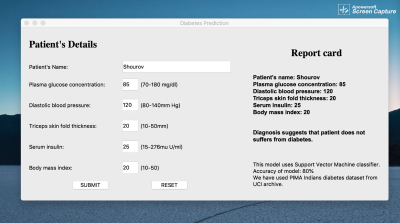

# Diabetes prediction application using Python

This application is made using sklearn Machine Learning libraries and pyqt5 for its graphical UI. 

Support Vector Machine classifies input data with 80% accuracy. PIMA Indians diabetes dataset from the UCI archive is used to train the model.



## How to start

Firstly install all dependencies via the following commands.

```bash
pip3 install -r requirements.txt
```

Now train the application in machine as

```bash
python3 diabetes.py
```

Finally run the application:

```bash
python3 gui.py
```
Now insert all the requires details to see the result.
